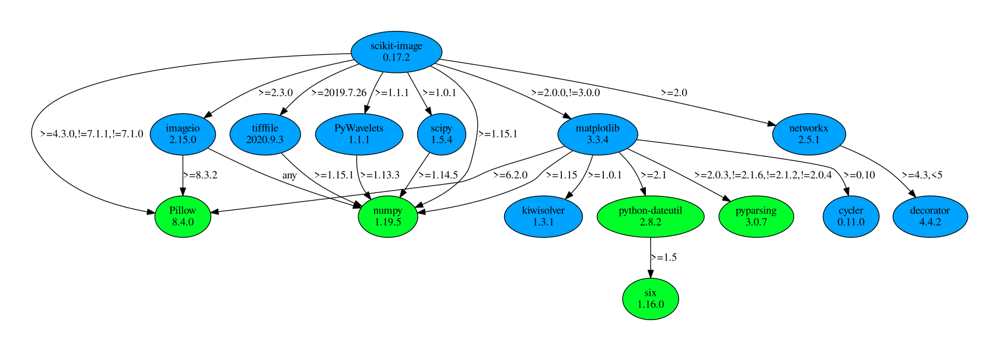

# Labels2Rois
## 1. Overview
This is an OMERO.web script to convert grey scale label images into OMERO ROIs.<br>
Depending on the python packages installed in the OMERO server virtual environment one can choose between Polygon or Mask as
a Shape for the ROIs.<br>

The script supports flexible label image locations, custom naming suffixes, and ROI management features for comparing different segmentation methods.

## 2. Naming convention
The script identifies label images by a customizable suffix (default: `-label`) in the filename.<br>
**Examples:**
- `cells.ome.tiff` → `cells-label.ome.tiff`
- `experiment.tif` → `experiment_nuclei.tif` (with suffix `_nuclei`)  
- `test.tif` → `test.tif.0.tif` (with suffix `.tif.0`)

### 2.1 Label Image Locations
Label images can be located in:
- **Same Dataset** (default): Original behavior, labels in same dataset as target images
- **Specific Dataset**: Search for labels in a different dataset by providing its ID

### 2.2 ROI Naming
Created ROIs are named using the label suffix and grey value: `{suffix}_{number}`
- `cells_cellpose.tif` → ROIs: `cellpose_1`, `cellpose_2`...
- `nuclei-stardist.png` → ROIs: `stardist_1`, `stardist_2`...

This allows easy comparison of different segmentation methods on the same image.

### 2.3 ROI Management
Optionally clear existing ROIs before adding new ones:
- **Clear All**: Remove all existing ROIs
- **Selective**: Only remove ROIs containing specific text (e.g., "cellpose")

## 3. Package dependencies
For the creation of the `Polygon` ROIs I rely on [ezomero](https://github.com/TheJacksonLaboratory/ezomero), a fantastic toolbox to make life easier for OMERO devs.<br>
Additionally, the script tries to import [omero_rois](https://github.com/ome/omero-rois/) and [scikit-image](https://github.com/scikit-image/scikit-image) and will give you feedback if those are not installed. Please consult your OMERO system-admin for installation.<br>
The reason two packages are needed, is to give you the option what type of ``omero.model.Shape`` you want to have for your ROI.<br>
>What is a **Shape**?:<br>
An OMERO ROI (`omero.model.Roi`) is a container object consisting of one or multiple Shapes (e.g. a Line, Polyline, Polygon, Mask, etc.) which constitute the actual forms/shapes you see in the OMERO.iviewer.

If you want to avoid additional packages and the related dependency-bloat you can still create Polygon Shapes as is, with just a small increase in script runtime.<br>
To achieve that I refactored the underlying Cython code from the relevant `scikit-image` function into "pure" Python, therefore having only `numpy` as dependency.

### 3.1 Mask Shape
Creating Mask Shapes for the ROIs relies on the package `omero_rois` created by the OME team.

### 3.2 Polygon Shape
Creating Polygon Shapes for the ROIs relies on the `find_contours()` function from [scikit-image](https://github.com/scikit-image/scikit-image/blob/main/skimage/measure/_find_contours.py).<br>
In short this functions relies on the "marching squares" algorithm. For more details read the comments in the source code linked above.<br>
To install `scikit-image` on our OMERO instance we had to install the following previously uninstalled packages:
```
PyWavelets, cycler, decorator, imageio, kiwisolver, matplotlib, networkx, scipy, tifffile
```

<br>

Here is the dependency tree (made with `pipdeptree`) for the `scikit-image` installation we performed on our server (**green**: existing packages, **blue**: newly installed packages):



## 4. Script Parameters
| Parameter | Description | Default |
|-----------|-------------|---------|
| `Label_Suffix` | Suffix identifying label images | `-label` |
| `Search_Mode` | Where to find labels: "Same Dataset" or "Specific Dataset" | Same Dataset |
| `Label_Dataset_ID` | Dataset ID when using "Specific Dataset" mode | - |
| `Clear_Existing_ROIs` | Remove existing ROIs before adding new ones | False |
| `Clear_ROI_Filter` | Only remove ROIs containing this text | - |

## 5. Caveats
- At the moment the input Data type is limited to Datasets and Images.<br>
This can easily expanded in the future if the need arises, just contact the author via mail or image.sc.<br>
- The script has not been tested on really complex ROI patterns. There might be situations where the underlying `find_contours()` function from `scikit-image` will fail to produce an accurate Polygon ROI.<br>
The underlying function to create Mask ROIs though is independent of shape complexity and might provide a good fallback option in this case.

## 6. Outlook
If you use the script and see room for improvement or have a special use case that is not covered by the generic code I wrote, please write an issue here at Github or contact me via mail or [Image.sc](https://forum.image.sc/).<br>
I might implement some logic to artificially create a Polygon Shape from the Mask Shape the is created with `omero_rois` to better deal with complex ROI forms.<br>
To make it more generic, there might also be the option to put in a regex pattern to determine the label images from the selection.

